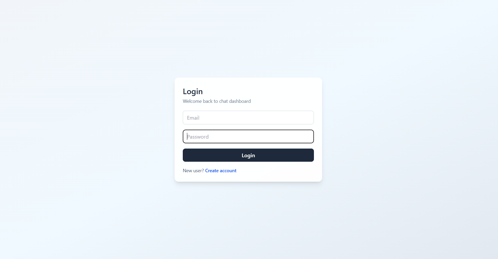
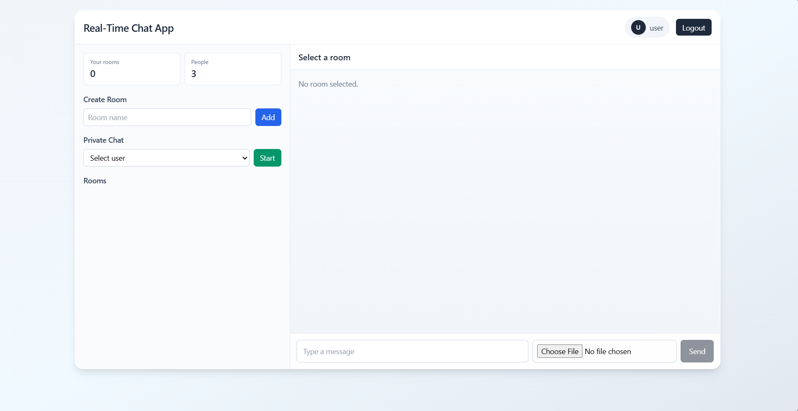
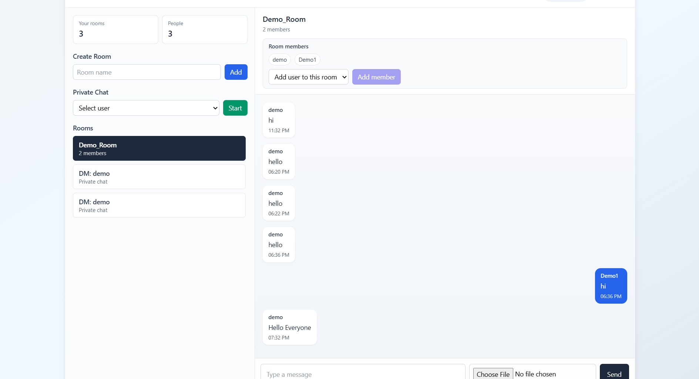
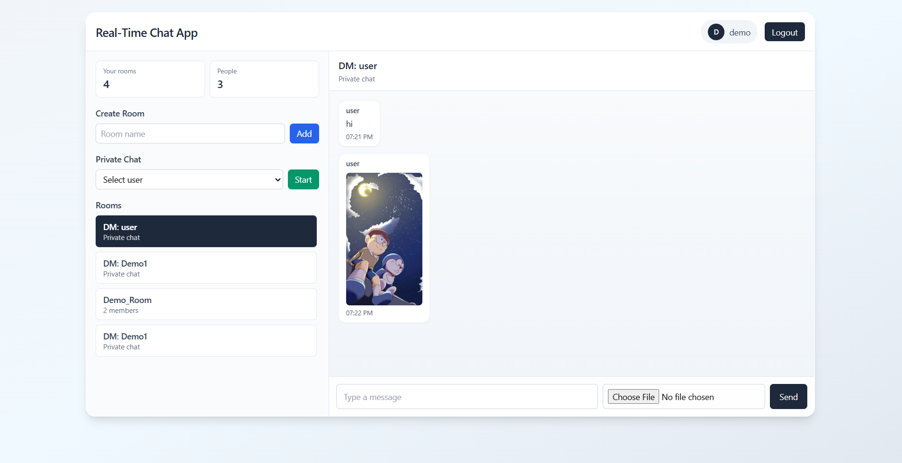
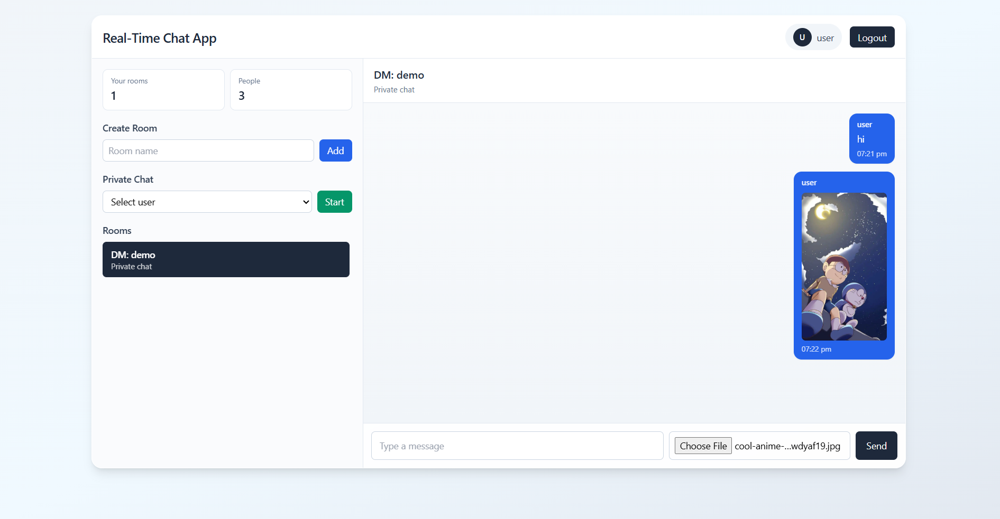
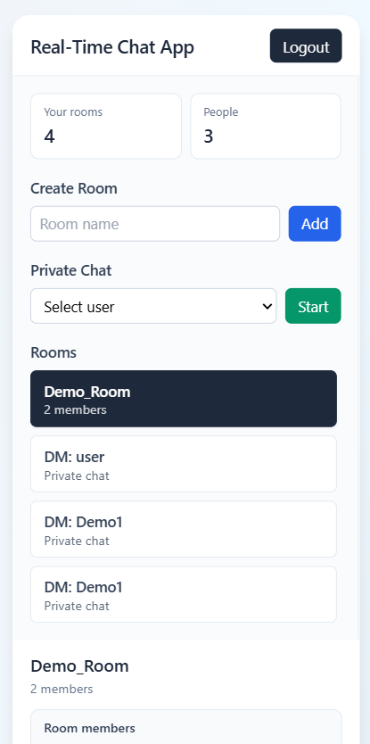

# Real-Time Chat Application (MERN + Socket.io)

## Project Overview


The app includes:

- Signup/Login authentication (JWT)
- Real-time messaging using Socket.io
- Group chat rooms
- Private one-to-one chats
- Media/file sharing (image/file upload)
- Persistent message history in MongoDB
- Responsive UI (mobile/tablet/desktop)

## Tech Stack

- MongoDB
- Express.js
- React (Vite)
- Node.js
- Socket.io
- Tailwind CSS (used for styling)

## Folder Structure

```text
chat-app/
|-- backend/
|   |-- src/
|   |-- uploads/
|   `-- package.json
|-- frontend/
|   |-- src/
|   `-- package.json
|-- docs/
|   `-- screenshots/
`-- README.md
```

## Features

- Signup/Login authentication with JWT
- Real-time chat using Socket.io
- Group rooms and private chats
- Add members to group rooms
- Media/file sharing support
- Message persistence in MongoDB
- Responsive UI

## Setup Steps (Run Locally)

### 1. Clone the repository

```bash
git clone https://github.com/Dhaneshvsp/chat-app.git
cd chat-app
```

### 2. Backend setup

```bash
cd backend
npm install
copy .env.example .env
```

Create and update `backend/.env`:

```env
PORT=5000
MONGO_URI=mongodb://127.0.0.1:27017/realtime_chat
JWT_SECRET=your_secret_key
CLIENT_URL=http://localhost:5173
```

Start backend:

```bash
npm run dev
```

### 3. Frontend setup (new terminal)

```bash
cd frontend
npm install
copy .env.example .env
```

Create and update `frontend/.env`:

```env
VITE_API_URL=http://localhost:5000/api
VITE_SOCKET_URL=http://localhost:5000
```

Start frontend:

```bash
npm run dev
```

Open:

- Frontend: `http://localhost:5173`
- Backend health: `http://localhost:5000/api/health`

## Environment Variables

### Backend (`backend/.env`)

```env
PORT=5000
MONGO_URI=mongodb://127.0.0.1:27017/realtime_chat
JWT_SECRET=your_secret_key
CLIENT_URL=http://localhost:5173
```

### Frontend (`frontend/.env`)

```env
VITE_API_URL=http://localhost:5000/api
VITE_SOCKET_URL=http://localhost:5000
```

## API and Socket Events

### REST APIs

- `POST /api/auth/signup`
- `POST /api/auth/login`
- `GET /api/auth/me`
- `GET /api/users`
- `POST /api/rooms`
- `GET /api/rooms`
- `GET /api/rooms/:roomId/messages`
- `POST /api/messages`
- `POST /api/rooms/:roomId/members`

### Socket Events

- `connection`
- `join_room`
- `send_message`
- `receive_message`
- `disconnect`

## Database Collections

### Users

- `_id`
- `name`
- `email`
- `password` (hashed)

### Rooms

- `_id`
- `name`
- `members[]`
- `isPrivate`
- `createdBy`

### Messages

- `_id`
- `senderId`
- `roomId`
- `message`
- `mediaUrl`
- `mediaType`
- `timestamp`

## Version Details

- Node.js: `v22.12.0`
- npm: `10.x`
- MongoDB: `7.x` 
- React: `18.3.1`
- Express: `4.19.2`
- Mongoose: `8.6.1`
- Socket.io: `4.7.5`
- Tailwind CSS: `3.4.10`


## Notes

- Private chats are one-to-one conversations.
- Group rooms can have multiple members.
- Messages are stored in MongoDB for chat history.

## Screenshots

### Signup Page


### Login Page


### Chat Dashboard


### Group Chat


### Private Chat


### Media Message


### Responsive View

